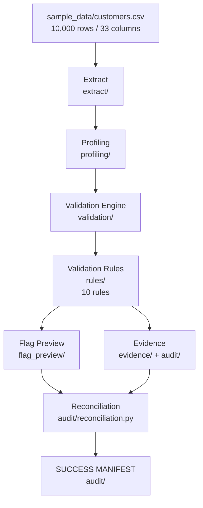
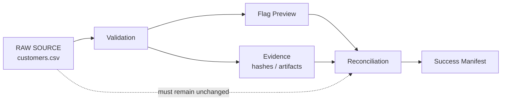
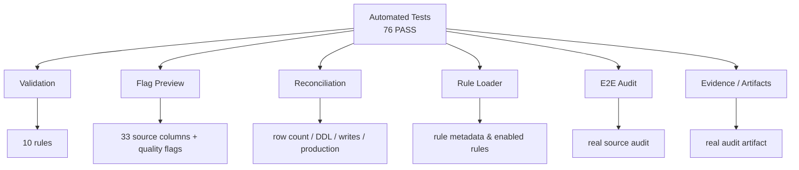
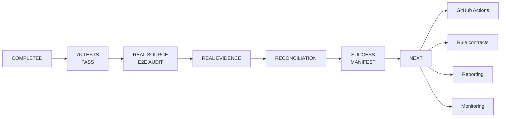

# Data Quality Audit Platform

A Python-based Data Quality and Audit platform for validating a real customer
source, producing non-destructive quality flags, collecting evidence, and
reconciling the audit execution before generating a success manifest.

## Project at a glance

| Item | Current status |
|---|---:|
| Source rows | **10,000** |
| Source columns | **33** |
| Validation rules executed | **10** |
| Automated tests | **76 PASS** |
| Current test warnings | **2 deprecation warnings** |
| Source modification | **None** |
| Production modification | **None** |

## End-to-End Architecture



## Audit Safety Model

The audit is designed to be non-destructive.



Reconciliation checks include:

- Row count remains unchanged.
- Source schema / DDL remains unchanged.
- Production data remains unchanged.
- No source write is performed.
- Evidence artifacts are produced.
- A success manifest is generated when the audit succeeds.

## Validation Rules

The platform currently executes **10 validation rules** across the
**33-column source dataset**:

1. Email validation
2. Phone validation
3. Website validation
4. ZIP validation
5. Name validation
6. Date validation
7. Duplicate validation
8. Schema validation
9. Invariant validation
10. PII validation

> **Important:** 33 is the number of source columns, not the number of
> validation rules.

## Repository Map

```mermaid
flowchart TD
    ROOT["Data-Quality"]

    ROOT --> APP["app/<br/>configuration"]
    ROOT --> AUDIT["audit/<br/>audit execution & evidence"]
    ROOT --> EXTRACT["extract/<br/>data extraction"]
    ROOT --> PROFILE["profiling/<br/>profiling"]
    ROOT --> VALIDATION["validation/<br/>validation engine"]
    ROOT --> RULES["rules/<br/>validation rules"]
    ROOT --> FLAGS["flag_preview/<br/>quality flags"]
    ROOT --> CLEAN["cleaning/<br/>cleaning components"]
    ROOT --> EVIDENCE["evidence/<br/>evidence artifacts"]
    ROOT --> REPORT["reporting/<br/>reporting"]
    ROOT --> RUNNER["runner/<br/>pipeline runners"]
    ROOT --> SCHEMA["schema/<br/>schema handling"]
    ROOT --> CORE["core/<br/>core pipeline"]
    ROOT --> STORAGE["storage/<br/>storage layer"]
    ROOT --> TESTS["tests/<br/>automated tests"]
    ROOT --> SAMPLE["sample_data/<br/>customers.csv"]
```



## Important Audit Components

```text
audit/
├── e2e_audit_run.py
├── evidence_manifest_writer.py
├── evidence_manifest.py
├── reconciliation.py
├── source_evidence.py
├── run_evidence.py
└── manifest_models.py
```

These components support the end-to-end audit, evidence collection,
source inspection, reconciliation, and manifest generation.

## Source Dataset

Current test source:

```text
sample_data/customers.csv
```

The source contains:

- **10,000 rows**
- **33 columns**

The current source schema used by the real-source test is:

```text
id
email_address
first_name
last_name
address
city
county_name
state
zip
website_source
phone_number
gender
dob
registration_date
valid
extra
email_id
ethnicity
ownrent
domain
main_interest
sub_interest
latitude
longitude
uploaded
country
websource_id
interest_ids
DNC
source
first_name_norm
last_name_norm
zip_norm
```

## Installation

Use Python 3.13+.

From the project root:

```powershell
python -m pip install -r requirements.txt
```

## Run All Tests

```powershell
python -m pytest -vv -s
```

Current expected result:

```text
76 passed, 2 warnings
```

## Run the Real-Source E2E Audit

```powershell
python -m pytest tests/test_e2e_audit_execution.py::test_e2e_audit_run_real_source -vv -s
```

Expected:

```text
PASSED
```

## Run the Real-Artifact Audit

```powershell
python -m pytest tests/test_e2e_audit_artifact.py -vv -s
```

Expected:

```text
PASSED
```

## Test Coverage Map



## Current Status

### Completed

- [x] Real-source end-to-end audit
- [x] 10 validation rules executed
- [x] 10,000-row source dataset
- [x] 33-column source schema
- [x] Non-destructive Flag Preview
- [x] Source row-count preservation
- [x] Source/schema reconciliation
- [x] DDL-change detection
- [x] Production-change detection
- [x] Source-write detection
- [x] Audit evidence generation
- [x] Success manifest generation
- [x] Automated test suite
- [x] **76 tests passing**

### Next

- [ ] Replace deprecated `datetime.utcnow()` usage with timezone-aware UTC
  timestamps.
- [ ] Add GitHub Actions CI.
- [ ] Strengthen versioned rule contracts.
- [ ] Expand audit/reporting capabilities.
- [ ] Improve operational documentation.
- [ ] Strengthen evidence and monitoring.

## Status Map



## Repository

https://github.com/aladdinoo/Data-Quality
